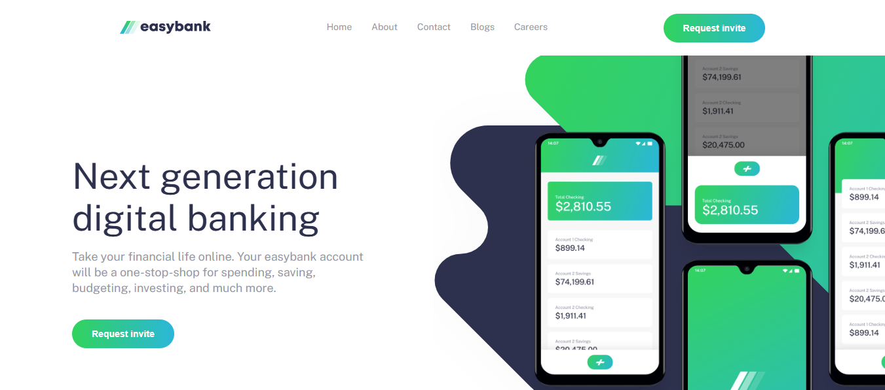

# Frontend Mentor - Easybank landing page solution

This is a solution to the [Easybank landing page challenge on Frontend Mentor](https://www.frontendmentor.io/challenges/easybank-landing-page-WaUhkoDN). Frontend Mentor challenges help you improve your coding skills by building realistic projects. 

## Table of contents

- [Overview](#overview)
  - [The challenge](#the-challenge)
  - [Screenshot](#screenshot)
  - [Links](#links)
- [My process](#my-process)
  - [Built with](#built-with)
  - [What I learned](#what-i-learned)
- [Author](#author)

## Overview
This a landing page for a banking company.

### The challenge

Users should be able to:

- View the optimal layout for the site depending on their device's screen size
- See hover states for all interactive elements on the page

### Screenshot




### Links

<!-- - Solution URL: [Add solution URL here](https://your-solution-url.com) -->
- Live Site URL: [Click right here!](https://santiagodev10.github.io/Digital-Bank-Landing-Page/)

## My process

### Built with

- Semantic HTML5 markup
- CSS custom properties
- Flexbox
- CSS Grid
- Mobile-first workflow

### What I learned

- I reenforce how to use the intersection observer object, to create the feature of the scroll to top button.

```js
const scrollToTop = new IntersectionObserver((entries) => {
    entries.forEach(entry => {
        const scrollToTopButton = document.querySelector('.scroll-to-top');
        if (entry.isIntersecting) {
            if (scrollToTopButton) {
                // Remove the event listener
                scrollToTopButton.removeEventListener('click', scrollToTopButton.handleClick);
                scrollToTopButton.remove();
            }
        } else {
            if (!scrollToTopButton) {
                const button = createScrollToTopButton();
                domElements.main.appendChild(button);
            }
        }
    });
});

scrollToTop.observe(domElements.header);
```
- I also directly manipulate the svg icons to change their colors, in order to do that we need to get access to it's source code.

```html
<a href="https://www.facebook.com/" target="_blank" rel="noopener noreferrer">
    <svg class="svg-icon" xmlns="http://www.w3.org/2000/svg" width="20" height="20"><path class="svg-icon-path" fill="#FFF" d="M18.896 0H1.104C.494 0 0 .494 0 1.104v17.793C0 19.506.494 20 1.104 20h9.58v-7.745H8.076V9.237h2.606V7.01c0-2.583 1.578-3.99 3.883-3.99 1.104 0 2.052.082 2.329.119v2.7h-1.598c-1.254 0-1.496.597-1.496 1.47v1.928h2.989l-.39 3.018h-2.6V20h5.098c.608 0 1.102-.494 1.102-1.104V1.104C20 .494 19.506 0 18.896 0z"/></svg>
</a>
```

- It probably be not so relevant, but i like the use of a literal object to organize the DOM calls in the JS file:

```js
const domElements = {
    hamMenu: document.querySelector('.ham-menu'),
    menu: document.querySelector('.nav-header--nav-links'),
    backdrop: document.querySelector('.nav-header--backdrop'),
    header: document.querySelector('header'),
    main: document.querySelector('main'),
    footer: document.querySelector('footer'),
};
```

## Author

- Frontend Mentor - [@santiagodev10](https://www.frontendmentor.io/profile/santiagodev10)
- Twitter - [@santiagoDev10](https://x.com/santiagoDev10)